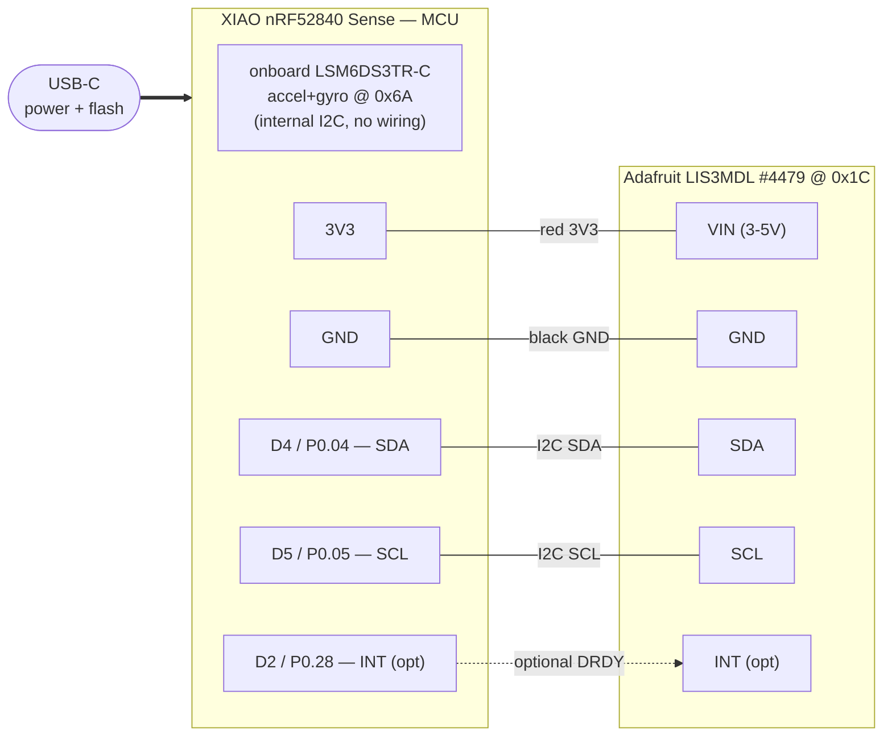

# Breadboard prototype — firefly-imu-carrier

> Goal: validate the **firmware and code architecture** (I2C sensor read → 9-DOF
> fusion → BLE notify → dashboard) **before** committing to the PCB. Powered over
> **USB-C**; the whole battery/protection section (Q1, J1, R1, C3) is board hardware
> and **does not affect the code** → omitted here.
>
> Sourcing done with the `kicad-pcb-stack` CLIs/MCP (`pcbparts` → JLCPCB+Mouser+DigiKey).

## Bill of Materials (minimum to test the code)

| # | Part | Purpose | Vendor / PN | Stock | Price |
|---|---|---|---|---|---|
| 1 | **XIAO nRF52840 Sense** (or Sense Plus) | MCU + onboard accel/gyro (LSM6DS3TR-C @0x6A) | Seeed `102010694` (direct) | in stock | ~$16.40 |
| 2 | **Adafruit LIS3MDL breakout** | magnetometer @0x1C → completes 9-DOF; includes pull-ups + 0.1" header | Adafruit `4479` / Mouser `485-4479` | 219 | $9.95 |
| 3 | Breadboard (½, 400 pts) | assembly | generic | — | ~$5 |
| 4 | Male-to-male jumpers | wiring (≥5) | generic | — | ~$5 |
| 5 | 0.1" header pins | solder onto the XIAO if not included | generic | — | ~$2 |
| 6 | **USB-C data cable** | power + flash | — | — | you have one |
| 7 | *(opt)* 1S LiPo + JST-PH | only to test sleep / wake-on-motion on battery | Seeed/Adafruit | — | ~$8 |

**Notes:**
- **No R2/R3 (I2C pull-ups) needed:** the Adafruit #4479 breakout already has them onboard.
  If you use a generic module WITHOUT pull-ups, add 2× 4.7 kΩ from SDA/SCL to 3V3.
- The #4479 runs at **3.3 V** → direct with the XIAO. 0.1" header included for breadboard.
- **Sense vs Sense Plus:** the firmware is identical (same nRF52840 + LSM6DS3TR-C, same I2C
  pins D4/D5). The **standard Sense** is easier on a breadboard (castellations); the **Plus**
  also works (its standard castellated row is still there; the 9 extra GPIO are on back SMD
  pads you won't use on a breadboard).
- **JLCPCB does not sell the XIAO module** (only the bare nRF52840 chip `C190794`) → the
  module comes from Seeed directly. The LIS3MDL chip for the PCB is on JLC (`C478483`, $5.02).

## Pinout / connections

**Wiring table (5 wires):**

| XIAO | → | LIS3MDL #4479 | Note |
|---|---|---|---|
| 3V3 | → | VIN | 3.3 V supply |
| GND | → | GND | common |
| D4 (P0.04) | → | SDA | I2C data |
| D5 (P0.05) | → | SCL | I2C clock |
| D2 (P0.28) | → | INT | optional (mag DRDY) |

> The accel+gyro (LSM6DS3TR-C) is already **inside** the XIAO → not wired.
> Two devices on the same I2C bus with no collision: **0x6A** (IMU) and **0x1C** (mag).

## Firmware tie-in

The scaffold in `firmware/src/main.cpp` already initializes this exact topology
(`Adafruit_LSM6DS3TRC` @0x6A + `Adafruit_LIS3MDL` @0x1C + Bluefruit). Flow:

1. `cd firmware && pio run -t upload` (board over USB-C — from the desktop x86_64).
2. Verify I2C enumeration (0x6A + 0x1C) over the serial monitor.
3. Port the real Madgwick fusion + the 20-byte BLE packet (brief §11).
4. Test the Web Bluetooth dashboard (Brave/Chromium).

Once the architecture is validated here, move to `/eda:schematic` with confidence.
