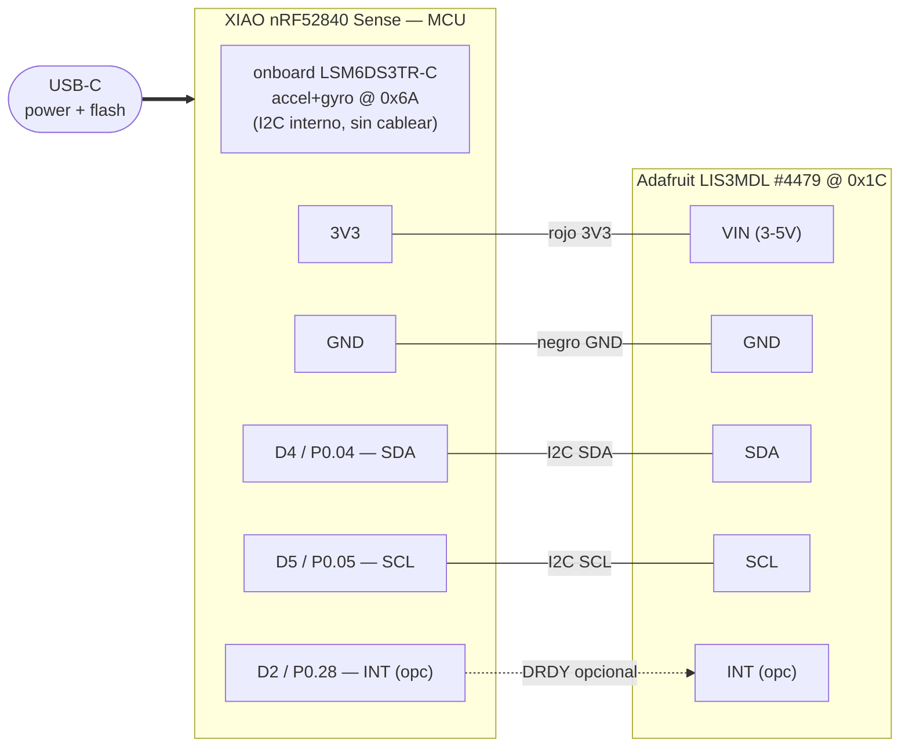

# Prototipo en breadboard — firefly-imu-carrier

> Objetivo: validar el **firmware y la arquitectura del código** (lectura I2C de
> sensores → fusión 9-DOF → BLE notify → dashboard) **antes** de comprometer la PCB.
> Se alimenta por **USB-C**; toda la parte de batería/protección (Q1, J1, R1, C3) es
> hardware de la placa y **no afecta al código** → se omite aquí.
>
> Sourcing hecho con las CLIs/MCP del `kicad-pcb-stack` (`pcbparts` → JLCPCB+Mouser+DigiKey).

## Bill of Materials (mínimo para probar el código)

| # | Parte | Para qué | Vendor / PN | Stock | Precio |
|---|---|---|---|---|---|
| 1 | **XIAO nRF52840 Sense** (o Sense Plus) | MCU + accel/gyro onboard (LSM6DS3TR-C @0x6A) | Seeed `102010694` (directo) | en stock | ~$16.40 |
| 2 | **Adafruit LIS3MDL breakout** | magnetómetro @0x1C → completa 9-DOF; trae pull-ups + header 0.1" | Adafruit `4479` / Mouser `485-4479` | 219 | $9.95 |
| 3 | Breadboard (½, 400 pts) | montaje | genérico | — | ~$5 |
| 4 | Jumpers macho-macho | cableado (≥5) | genérico | — | ~$5 |
| 5 | Header pins 0.1" | soldar al XIAO si no los trae | genérico | — | ~$2 |
| 6 | Cable **USB-C de datos** | alimentar + flashear | — | — | tienes |
| 7 | *(opc)* LiPo 1S + JST-PH | solo para probar sleep / wake-on-motion con batería | Seeed/Adafruit | — | ~$8 |

**Notas:**
- **No se necesitan R2/R3 (pull-ups I2C):** el breakout Adafruit #4479 ya los trae onboard.
  Si usas un módulo genérico SIN pull-ups, añade 2× 4.7 kΩ de SDA/SCL a 3V3.
- El #4479 opera a **3.3 V** → directo con el XIAO. Header 0.1" incluido para protoboard.
- **Sense vs Sense Plus:** el firmware es idéntico (mismo nRF52840 + LSM6DS3TR-C, mismos
  pines I2C D4/D5). El **Sense estándar** es más cómodo en protoboard (castellaciones);
  el **Plus** también sirve (su fila castellada estándar sigue ahí; los 9 GPIO extra están
  en pads traseros SMD que no usarás en breadboard).
- **JLCPCB no vende el módulo XIAO** (solo el chip nRF52840 suelto `C190794`) → el módulo
  va de Seeed directo. El chip LIS3MDL para la PCB sí está en JLC (`C478483`, $5.02).

## Pinout / conexiones

**Tabla de cableado (5 hilos):**

| XIAO | → | LIS3MDL #4479 | Nota |
|---|---|---|---|
| 3V3 | → | VIN | alimentación 3.3 V |
| GND | → | GND | común |
| D4 (P0.04) | → | SDA | I2C datos |
| D5 (P0.05) | → | SCL | I2C reloj |
| D2 (P0.28) | → | INT | opcional (DRDY del mag) |

> El accel+gyro (LSM6DS3TR-C) ya está **dentro** del XIAO → no se cablea.
> Dos dispositivos en el mismo bus I2C sin colisión: **0x6A** (IMU) y **0x1C** (mag).

## Tie-in con el firmware

El scaffold en `firmware/src/main.cpp` ya inicializa exactamente esta topología
(`Adafruit_LSM6DS3TRC` @0x6A + `Adafruit_LIS3MDL` @0x1C + Bluefruit). Flujo:

1. `cd firmware && pio run -t upload` (placa por USB-C — desde el desktop x86_64).
2. Verificar enumeración I2C (0x6A + 0x1C) por el monitor serial.
3. Portar la fusión Madgwick real + el paquete BLE de 20 bytes (brief §11).
4. Probar el dashboard Web Bluetooth (Brave/Chromium).

Validada la arquitectura aquí, se pasa a `/eda:schematic` con confianza.
